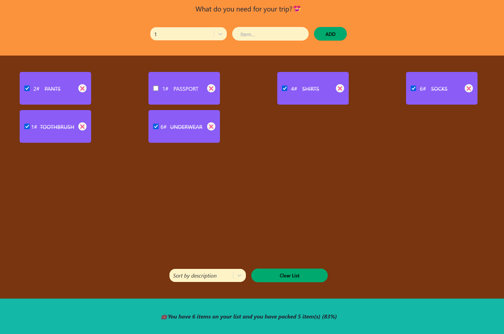

# Overview

This project has been created as part of the Ultimate React Course by Jonas Schmedtmann. It has been adapted and created with Vite, TypeScript and Tailwind **instead** of imported CSS, Create-React-App (webpack) and JavaScript which was used in the course.

## Scope

The purpose of this project was to cover the following React concepts:
- What state and props are
- The difference between state and props
- When to use state or props and why
- Sharing data & state via props
- Derived state
- Controlled elements
- When and how React renders state

## Images

